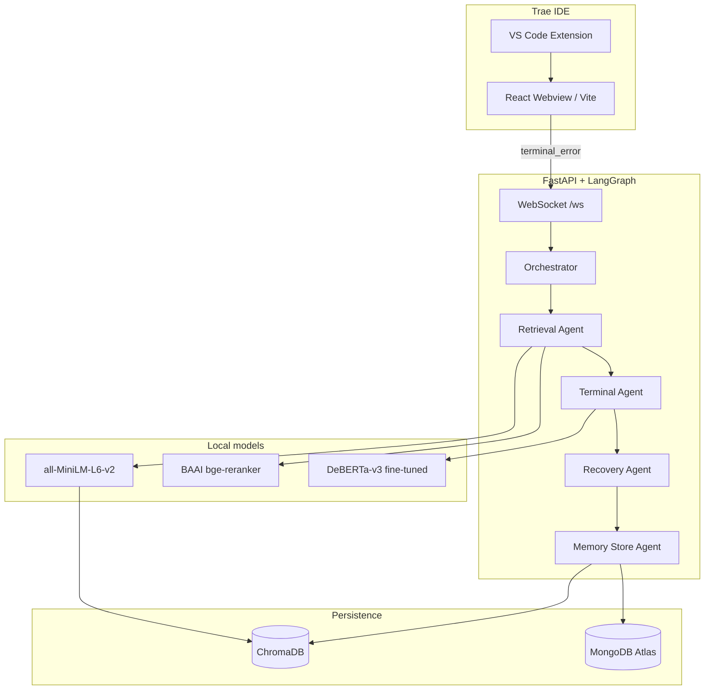

# TraeGuardian

TraeGuardian is an autonomous terminal-recovery agent system for **Trae IDE** (VS Code–compatible). It uses **only local/open models** — no OpenAI, Anthropic, or other API-key LLMs. Persistence runs on **MongoDB Atlas**; semantic memory uses **ChromaDB** with **all-MiniLM-L6-v2** embeddings and **BAAI/bge-reranker-base** reranking. Error classification is handled by a fine-tuned **DeBERTa-v3** model, orchestrated with **LangGraph**.

---

## Table of contents

1. [Purpose of the Project](#purpose-of-the-project)
2. [Who Will Use TraeGuardian?](#who-will-use-traeguardian)
3. [Why TraeGuardian Is Better Than Others](#why-traeguardian-is-better-than-others)
4. [Product Use Cases](#product-use-cases)
5. [Importance in Trae IDE as an Extension](#importance-in-trae-ide-as-an-extension)
6. [Architecture](#architecture)
7. [Agent Pipeline](#agent-pipeline)
8. [Tech Stack](#tech-stack)
9. [Prerequisites](#prerequisites)
10. [Quick Start](#quick-start)
11. [Trae IDE Extension Install](#trae-ide-extension-install)
12. [Configuration](#configuration)
13. [Training DeBERTa-v3](#training-deberta-v3)
14. [API & WebSocket](#api--websocket)
15. [Project Layout](#project-layout)
16. [Troubleshooting](#troubleshooting)

---

## Purpose of the Project

TraeGuardian is designed to **automate terminal error diagnosis and recovery** directly within your IDE. Its core mission:
- Eliminate manual web searches for common errors
- Provide structured, actionable fixes using AI agents
- Learn from past resolutions to get smarter over time
- Keep everything local and private with open-source models only

---

## Who Will Use TraeGuardian?

| User Persona | Use Case |
|---------------|----------|
| **Software Developers** | Streamline debugging in daily workflows; avoid repetitive Google searches for errors |
| **Engineering Teams** | Share error resolutions across the organization; maintain a collective knowledge base of fixes |
| **DevOps Engineers** | Automate error diagnosis in production pipelines; reduce mean time to resolution (MTTR) |
| **Open Source Contributors** | Speed up debugging when working on unfamiliar codebases |
| **Students & Learners** | Learn best-practice fixes for common programming errors |

---

## Why TraeGuardian Is Better Than Others

| Feature | TraeGuardian | Competitors (GitHub Copilot, etc.) |
|---------|---------------|------------------------------------|
| **Model Privacy** | 100% local/open models only | Requires cloud-based API keys |
| **No External Costs** | Free forever (no API usage fees) | Pay-per-token pricing models |
| **IDE Integration** | Built specifically for Trae IDE | Generic VS Code extensions |
| **Multi-Agent System** | LangGraph orchestration with specialized agents | Single LLM approach |
| **Semantic Memory** | ChromaDB + BGE reranker for smart recall | Limited context window |
| **Persistent Learning** | MongoDB stores resolutions for future use | No built-in learning mechanism |
| **Terminal-First** | Designed specifically for terminal errors | General-purpose code completion |

---

## Product Use Cases

### 1. Daily Development Debugging
- **Problem**: You hit a "Cannot find module 'express'" error and waste 10 minutes on Stack Overflow
- **Solution**: TraeGuardian analyzes the error, retrieves similar past fixes, and gives you a step-by-step recovery plan

### 2. Team Knowledge Sharing
- **Problem**: A new team member hits an error your team solved 6 months ago, but no one remembers the fix
- **Solution**: TraeGuardian pulls the exact resolution from MongoDB/ChromaDB and applies it automatically

### 3. Production Pipeline Diagnostics
- **Problem**: Your CI/CD pipeline fails with a cryptic build error at 2 AM
- **Solution**: TraeGuardian integrates with your pipeline, classifies the error type, and suggests a fix immediately

### 4. Onboarding & Training
- **Problem**: New developers spend weeks learning your team's common error patterns
- **Solution**: TraeGuardian acts as an always-available mentor, showing best-practice fixes in real-time

---

## Importance in Trae IDE as an Extension

TraeGuardian is **not just a web app** — it's a native Trae IDE extension that:

### Key Extension Features:
1. **Seamless IDE Integration**
   - Activity bar icon for one-click access
   - Automatically captures terminal errors from Trae IDE
   - No context switching between browser and IDE

2. **Auto-Start Services**
   - Spawns backend + frontend automatically when extension activates
   - Health monitoring ensures everything is running smoothly

3. **Project-Specific Context**
   - Reads your repo's git context
   - Tailors error resolutions to your project's tech stack
   - GitHub repo integration for project-specific memory

4. **Terminal-Style UI**
   - Professional terminal-themed dashboard within Trae IDE
   - Familiar command-line aesthetics for developers
   - Scanline effects and retro-terminal styling

---

## Architecture



| Layer | Path | Role |
|-------|------|------|
| Extension | `extension/` | Trae/VS Code sidebar, auto-starts backend + frontend |
| Frontend | `frontend/` | Terminal-style dashboard, WebSocket client, health polling |
| Backend | `backend/` | FastAPI, LangGraph agents, model inference |
| Data | `data/chroma/`, MongoDB | Vectors + checkpoints / session history |

---

## Agent Pipeline

When the UI (or IDE) sends a `terminal_error` event, LangGraph runs **four nodes** in order:

| Step | Node | What it does |
|------|------|----------------|
| 1 | **retrieval** | Embeds the error with MiniLM, queries ChromaDB, reranks top hits with BGE |
| 2 | **terminal_agent** | DeBERTa-v3 classifies error type + merges label-specific analysis with retrieved context |
| 3 | **recovery_agent** | Builds a structured fix plan (templates + best reranked memory match) |
| 4 | **memory_store** | Upserts the case into Chroma + saves checkpoint & pair in MongoDB |

There is **no mock/fallback path**. If models or MongoDB are unavailable, startup fails clearly during bootstrap.

### Error types (DeBERTa labels)

- `module_not_found`
- `syntax_error`
- `permission_denied`
- `port_in_use`
- `env_missing`
- `build_failed`
- `type_error`
- `network_error`
- `unknown`

Seed examples live in `backend/training/seed_data.json` (used for training and initial Chroma seeding).

---

## Tech Stack

| Component | Technology |
|-----------|------------|
| IDE integration | VS Code Extension API (Trae-compatible) |
| UI | React 19, Vite 8, Tailwind, Framer Motion, Zustand |
| API | FastAPI, Uvicorn, WebSockets |
| Orchestration | LangGraph `StateGraph` |
| Vector DB | ChromaDB (persistent, local disk) |
| Document DB | MongoDB Atlas (`pymongo`) |
| Embeddings | `sentence-transformers/all-MiniLM-L6-v2` |
| Reranker | `BAAI/bge-reranker-base` via `FlagEmbedding` |
| Classifier | `microsoft/deberta-v3-small` fine-tuned on terminal errors |

---

## Prerequisites

- **Node.js** 18+
- **Python** 3.10–3.12 (3.11 recommended on Windows)
- **Trae IDE** with shell command: Command Palette → *Shell Command: Install 'trae' command in PATH*
- **MongoDB Atlas** network access allowed for your IP (cluster in `.env`)
- ~2–4 GB disk for PyTorch + model caches (first run downloads weights from Hugging Face)

---

## Quick Start

### 1. Backend (ML + API)

```powershell
cd d:\trae-guard
powershell -ExecutionPolicy Bypass -File scripts\setup-backend.ps1
```

Or manually:

```powershell
cd backend
py -3 -m venv venv
.\venv\Scripts\Activate.ps1
pip install -r requirements.txt
python -m training.train_deberta
python -m uvicorn main:app --host 127.0.0.1 --port 8000
```

First `uvicorn` start also runs `startup.bootstrap()`:

- Pings MongoDB
- Loads MiniLM + BGE reranker
- Trains DeBERTa if `models/deberta-terminal/` is missing
- Seeds Chroma from `seed_data.json` if empty

Verify: [http://127.0.0.1:8000/health](http://127.0.0.1:8000/health)

### 2. Frontend

```powershell
cd frontend
npm install
npm run dev
```

UI: [http://127.0.0.1:5173](http://127.0.0.1:5173)

### 3. Extension (development)

```powershell
cd extension
npm install
npm run compile
```

Press **F5** in VS Code/Trae (opens Extension Development Host) or install into Trae (below).

---

## Trae IDE Extension Install

```powershell
cd d:\trae-guard
npm run install:all
npm run install:trae
```

This compiles the extension, builds the webview bundle, packages a `.vsix`, and runs:

```text
trae --install-extension traeguardian-0.0.1.vsix
```

Reload Trae (**Developer: Reload Window**), then open the **TraeGuardian** activity bar icon. With `traeguardian.autoStartServices` enabled (default), the extension spawns backend + Vite automatically.

---

## Configuration

Copy `backend/.env.example` → `backend/.env`:

| Variable | Description |
|----------|-------------|
| `MONGODB_URI` | MongoDB Atlas connection string |
| `MONGODB_DB` | Database name (default `traeguardian`) |
| `CHROMA_PERSIST_DIR` | Chroma persistence folder |
| `DEBERTA_MODEL_DIR` | Fine-tuned DeBERTa output path |
| `EMBEDDING_MODEL` | Default `all-MiniLM-L6-v2` |
| `RERANKER_MODEL` | Default `BAAI/bge-reranker-base` |
| `DEBERTA_BASE` | Hugging Face base for training |

Extension settings (`traeguardian.*`):

- `autoStartServices` — spawn backend + frontend on activate
- `useDevServer` — iframe to Vite vs bundled webview
- `backendPort` / `frontendPort` — default 8000 / 5173

---

## Training DeBERTa-v3

```powershell
cd backend
.\venv\Scripts\python.exe -m training.train_deberta
```

- Reads `training/seed_data.json`
- Fine-tunes `microsoft/deberta-v3-small`
- Saves to `backend/models/deberta-terminal/`
- Writes `labels.json` for inference

Add more labeled rows to `seed_data.json` and re-run training to improve classification.

---

## API & WebSocket

### REST

| Endpoint | Description |
|----------|-------------|
| `GET /` | Service info |
| `GET /health` | MongoDB, Chroma, model load status |

### WebSocket `ws://127.0.0.1:8000/ws`

**Client → server**

```json
{ "type": "terminal_error", "error_log": "...", "session_id": "default", "project_context": "..." }
{ "type": "restore_session", "session_id": "default" }
{ "type": "ping" }
```

**Server → client**

```json
{ "type": "agent_status", "agent": "Terminal", "status": "DeBERTa-v3 root cause analysis..." }
{ "type": "agent_response", "agent": "Recovery", "message": "...", "error_type": "module_not_found", "confidence": 0.92 }
```

---

## Project Layout

```text
trae-guard/
├── backend/
│   ├── main.py              # FastAPI + WebSocket
│   ├── startup.py           # Bootstrap models + Chroma seed
│   ├── config.py
│   ├── agents/              # LangGraph nodes + orchestrator
│   ├── memory/              # MongoDB + Chroma
│   ├── models/              # MiniLM, BGE, DeBERTa loaders
│   └── training/            # seed_data.json, train_deberta.py
├── frontend/                # React dashboard
├── extension/               # Trae/VS Code extension
├── scripts/
│   ├── setup-backend.ps1
│   └── install-to-trae.ps1
└── data/chroma/             # Created at runtime (gitignored)
```

---

## Troubleshooting

| Issue | Fix |
|-------|-----|
| `did not find executable` for venv Python | Run `scripts/setup-backend.ps1` to recreate venv with `py -3` |
| MongoDB timeout / SSL error | Atlas → Network Access: allow your IP (or `0.0.0.0/0` for dev). Ensure `HF_TOKEN` is set in `backend/.env` |
| First start very slow | Hugging Face downloads MiniLM, BGE, DeBERTa; wait for `/health` → `models_ready: true` |
| Chroma empty | Restart backend once; `startup.py` seeds from `seed_data.json` |
| Trae command not found | Install `trae` shell command from Trae Command Palette |
| Webview blank | Ensure frontend on port 5173 or set `useDevServer: false` and run `npm run build:webview` |

---

## License

MIT — see repository for details.
